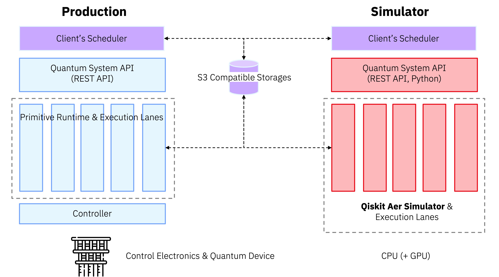

# Fake Quantum Resource

*A local, offline stand-in for the IBM Quantum System API, used to validate QRMI and its workload manager plugin (e.g., Slurm's SPANK plugin, PBS Hooks, LSF esub) without real quantum hardware.*

Currently, testing job submission requires connecting to a vendor backend/cloud. That dependency creates real friction: developers need credentials just to run example code, integration testing becomes harder to set up and less repeatable, and every submitted job carries a real cost.

Fake Quantum Resource removes all three constraints by running a local, offline API simulator that stands in for the IBM Quantum System API:

* **No credentials required** — run and test example code without provisioning access to a vendor backend
* **Reliable integration testing** — exercise the full path (workload manager job submission → scheduling → job execution, including the workload manager's plugin/module → QRMI → quantum resource) against a stable, local target. This guide uses Slurm as an example; the Qiskit/QRMI code itself is workload-manager-agnostic and runs unchanged under PBS, LSF, or any other supported workload manager — only the job submission script and the workload manager's own plugin/module (e.g., Slurm's SPANK plugin, PBS Hooks, LSF esub) differ.
* **No cost** — submit as many jobs as you need without paying for real backend time

The sections below cover what it's built on and how to get it running locally.

## IBM Quantum System API

The Quantum System API is HTTP REST API which provides easy integrations of client’s on-premise IBM Quantum backend and their scheduler/workflow.

The following functionalities are covered by the Quantum System API:
* Version
  * Get latest API version (`GET /version`)
  * Get list of supported API versions (`GET /versions`)
* Backends
  * Get list of backends (`GET /v1/backends`)
  * Get backend details (`GET /v1/backends/{backend-name}`)
  * Get backend configuration (`GET /v1/backends/{backend-name}/configuration`)
  * Get backend properties (`GET /v1/backends/{backend-name}/properties`)
  * Get backend lanes configuration (`GET /v1/backends/{backend-name}/lanes`)
* Jobs
  * Get jobs (`GET /v1/jobs`)
  * Get a job by ID (`GET /v1/jobs/{job_id}`)
  * Run a job (`POST /v1/jobs`)
  * Delete a job (`DELETE /v1/jobs/{job_id}`)
  * Cancel a job (`POST /v1/jobs/{job_id}/cancel`)

For more details, refer [Quantum System API document](https://quantum.cloud.ibm.com/docs/en/api/quantum-system-rest).

## IBM Quantum System API Simulator (qsa_sim)

This API simulator is a portable, locally executable application built with [Qiskit Aer Simulator](https://github.com/Qiskit/qiskit-aer) as a backend. Quantum System API client developers can use this API simulator to develop and test API clients without having access to the actual quantum backend or Quantum System API instance, increasing development productivity. Developers can use their Linux (RedHat, Ubuntu), macOS and Windows machine to run this API simulator, and it supports Python 3.11 or above versions as runtime.

<p align="center">
  
</p>

For more details of this API simulator, refer [README](./docs/simulator/README.md).

## Prerequisites

* [Docker](https://docs.docker.com/get-docker/) or [Podman](https://podman.io/getting-started/installation)
* Docker Compose (bundled with Docker Desktop / `docker compose`) or `podman-compose`
* QRMI (IBM) and the workload manager's plugin/module (e.g., Slurm's SPANK plugin) already deployed on the cluster you'll be testing against

## Installation

Create a `.env` file in the project root:

```env
QSASIM_IAM_APIKEY=myapikey
QSASIM_SERVICE_CRN=myinstance
QSASIM_BIND_PORT=8292
PYTHONUNBUFFERED=1
MINIO_ACCESS_KEY=bbFJoygjrP5BdqnQ
MINIO_SECRET_KEY=CAMHACH4bFlr0R2E
MINIO_BUCKET_NAME=mybucket
MINIO_PORT=9000
MINIO_CONSOLE_PORT=9001
```

> [!NOTE]
> These are sample values for local development only. Use your own values, keep `.env` out of version control, and match `QSASIM_IAM_APIKEY` / `QSASIM_SERVICE_CRN` with the values configured on the QRMI side (`QRMI_IBM_QS_IAM_APIKEY` / `QRMI_IBM_QS_SERVICE_CRN`).

| Variable | Description |
| --- | --- |
| `QSASIM_IAM_APIKEY` | IAM API key accepted by the simulator's `/identity/token` endpoint, in addition to the keys listed under `auth.iam_apikeys` in `config.yaml`. Set this to the same value your QRMI configuration uses for `QRMI_IBM_QRS_IAM_APIKEY`. |
| `QSASIM_SERVICE_CRN` | The `Service-CRN` value the simulator expects on incoming requests (overrides `service_crn` in `config.yaml`). Should match `QRMI_IBM_QRS_SERVICE_CRN` on the client/QRMI side. |
| `QSASIM_BIND_PORT` | Port the API simulator listens on, and the host port it's mapped to by `docker-compose.yml`. Overrides `port` in `config.yaml`. |
| `PYTHONUNBUFFERED` | Disables Python's stdout/stderr buffering so simulator logs appear immediately in `docker compose logs` instead of being buffered. |
| `MINIO_ACCESS_KEY` | Access key for the MinIO S3-compatible storage used to exchange job inputs, outputs, and logs (via presigned URLs) between QRMI and the simulator. |
| `MINIO_SECRET_KEY` | Secret key paired with `MINIO_ACCESS_KEY`. |
| `MINIO_BUCKET_NAME` | Name of the bucket auto-created by the `createbuckets` service at startup, used to store job inputs, outputs, and logs. |
| `MINIO_PORT` | Host port mapped to MinIO's S3 API port (container port `9000`). |
| `MINIO_CONSOLE_PORT` | Host port mapped to the MinIO web console (container port `9001`), useful for browsing stored objects while debugging. |

Then build and start everything:

```bash
docker compose up --build
# or: podman-compose up --build
```

Once running, the simulator's API docs are available at `http://localhost:${QSASIM_BIND_PORT}/docs` (Swagger) and `/redoc` (ReDoc), and the MinIO console at `http://localhost:${MINIO_CONSOLE_PORT}`.

## Testing with Slurm

This section walks through Slurm as a concrete example. The Qiskit/QRMI workload itself (`bell_state.py` below) is workload-manager-agnostic — the same code runs unchanged under PBS, LSF, or any other supported workload manager; only the job submission script and the workload manager's own plugin/module (Slurm's SPANK plugin, PBS Hooks, LSF esub, etc.) differ.

Once Fake Quantum Resource is up and running, you can use it to exercise the full end-to-end path — `sbatch` job submission → Slurm scheduling → job execution → the QRMI SPANK plugin → QRMI → Fake Quantum Resource — without any real quantum backend.

Crucially, this uses the same QRMI and SPANK plugin binaries already deployed on the Slurm cluster, unmodified — nothing about QRMI or the plugin needs to be rebuilt, patched, or configured differently for testing. Fake Quantum Resource only changes what those binaries talk to: point the `environment` block in `qrmi_config.json` at the simulator instead of a real vendor endpoint, and the exact same production code path gets exercised.

### 1. Register the fake resource with QRMI

On each Slurm node that will run quantum jobs, define the resource in `/etc/slurm/qrmi_config.json`. The `type` must be `ibm-quantum-system`, and the `environment` block should reuse the same values you set in `.env`:

```json
{
  "name": "fake_brisbane",
  "type": "ibm-quantum-system",
  "environment": {
    "QRMI_IBM_QS_ENDPOINT": "http://192.168.1.128:8292",
    "QRMI_IBM_QS_IAM_ENDPOINT": "http://192.168.1.128:8292",
    "QRMI_IBM_QS_IAM_APIKEY": "myapikey",
    "QRMI_IBM_QS_SERVICE_CRN": "myinstance",
    "QRMI_IBM_QS_AWS_ACCESS_KEY_ID": "bbFJoygjrP5BdqnQ",
    "QRMI_IBM_QS_AWS_SECRET_ACCESS_KEY": "CAMHACH4bFlr0R2E",
    "QRMI_IBM_QS_S3_ENDPOINT": "http://192.168.1.128:9000",
    "QRMI_IBM_QS_S3_BUCKET": "mybucket",
    "QRMI_IBM_QS_S3_REGION": "us-east"
  }
}
```

> [!NOTE]
> Replace `192.168.1.128` with the actual hostname/IP of the machine running `docker compose up`, reachable from your Slurm compute nodes (not `localhost`, unless the compute node *is* that machine). `name` (`fake_brisbane` here) is just the resource ID used with `--qpu=` on `sbatch` — it doesn't need to match a real backend name, though picking one of the simulator's built-in backends (`FakeBrisbane`, `FakeTorino`, `FakeCairoV2`, `FakeLagosV2`) keeps things intuitive.

| `qrmi_config.json` field | Value | Corresponds to `.env` variable |
| --- | --- | --- |
| `QRMI_IBM_QS_ENDPOINT` | `http://<host>:${QSASIM_BIND_PORT}` | `QSASIM_BIND_PORT` |
| `QRMI_IBM_QS_IAM_ENDPOINT` | `http://<host>:${QSASIM_BIND_PORT}` | `QSASIM_BIND_PORT` (the simulator serves `/identity/token` on the same port) |
| `QRMI_IBM_QS_IAM_APIKEY` | `myapikey` | `QSASIM_IAM_APIKEY` |
| `QRMI_IBM_QS_SERVICE_CRN` | `myinstance` | `QSASIM_SERVICE_CRN` |
| `QRMI_IBM_QS_AWS_ACCESS_KEY_ID` | `bbFJoygjrP5BdqnQ` | `MINIO_ACCESS_KEY` |
| `QRMI_IBM_QS_AWS_SECRET_ACCESS_KEY` | `CAMHACH4bFlr0R2E` | `MINIO_SECRET_KEY` |
| `QRMI_IBM_QS_S3_ENDPOINT` | `http://<host>:${MINIO_PORT}` | `MINIO_PORT` |
| `QRMI_IBM_QS_S3_BUCKET` | `mybucket` | `MINIO_BUCKET_NAME` |
| `QRMI_IBM_QS_S3_REGION` | `us-east` | — (MinIO doesn't enforce regions; any value works as long as it's consistent) |

### 2. Sample workload

A minimal Bell-state circuit is enough to validate the entire pipeline end-to-end without needing a complex payload. Save this as, e.g., `bell_state.py`:

```python
import logging
from logging import getLogger, INFO
import random
from qiskit import QuantumCircuit
from qiskit.transpiler.preset_passmanagers import generate_preset_pass_manager
from qrmi.primitives import QRMIService
from qrmi.primitives.ibm import SamplerV2, get_target

logging.basicConfig(
    level=INFO,
    format="%(asctime)s %(levelname)s %(message)s",
)
logger = getLogger(__name__)

# Create QRMI
service = QRMIService()

resources = service.resources()
if len(resources) == 0:
    raise ValueError("No quantum resource is available.")

for res in resources:
    logger.info(
        "Available resource: id=%s type=%s", res.resource_id(), str(res.resource_type())
    )

# Randomly select QR
qrmi = resources[random.randrange(len(resources))]
logger.info(qrmi.metadata())

# Create a Bell state circuit.
qc = QuantumCircuit(2, 2)
qc.h(0)
qc.cx(0, 1)
qc.measure([0, 1], [0, 1])

# Generate transpiler target from backend configuration & properties
target = get_target(qrmi)

# The circuit and observable need to be transformed to only use instructions
# supported by the QPU (referred to as instruction set architecture (ISA) circuits).
# We'll use the transpiler to do this.
pm = generate_preset_pass_manager(
    optimization_level=1,
    target=target,
)
isa_circuit = pm.run(qc)
logger.info("circuit ops (ISA): %s", isa_circuit.count_ops())

# Initialize QRMI Sampler
sampler = SamplerV2(qrmi)

# Next, invoke the run() method to generate the output. The circuit and optional
# parameter value sets are input as primitive unified bloc (PUB) tuples.
job = sampler.run([isa_circuit], shots=1024)
logger.info("Job ID: %s", job.job_id())
try:
    result = job.result()

    # Get results for the first (and only) PUB
    pub_result = result[0]
    logger.info(
        "Counts for the 'c' output register: %s", pub_result.data.c.get_counts()
    )
    print(qrmi.task_logs(job.job_id()))

except RuntimeError as err:
    logger.exception(err)

logger.info("Finished")
```

### 3. Submit the job

Wrap the workload in a Slurm job script that requests the fake resource by name via `#SBATCH --qpu=`, which the QRMI SPANK plugin picks up to select the matching entry in `qrmi_config.json`. Save this as, e.g., `run_sampler.sh`:

```bash
#!/bin/bash

#SBATCH --job-name=bell_state_example
#SBATCH --ntasks=1
#SBATCH --cpus-per-task=1
#SBATCH --qpu=fake_brisbane

# Your script goes here
source /shared/pyenv/bin/activate
srun python /shared/job_scripts/bell_state.py
```

Then submit it:

```bash
sbatch run_sampler.sh
```

A successful run confirms the whole chain is wired correctly: Slurm accepted and scheduled the job, the SPANK plugin resolved `fake_brisbane` to the QRMI environment above, QRMI authenticated against `/identity/token` and fetched the backend target, the circuit was submitted and executed by the simulator, and results/logs round-tripped through MinIO.

> [!TIP]
> This job script and `bell_state.py` are the same code you'd run in production — to point at a real quantum resource instead of the simulator, just change `--qpu=fake_brisbane` to the resource name defined for it in `qrmi_config.json`.

## License

[Apache License 2.0](./LICENSE.txt)

